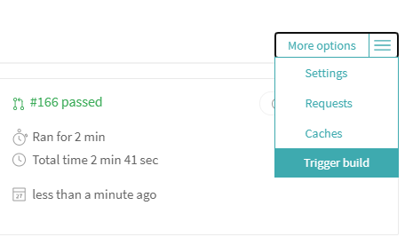

<!--
*** Thanks for checking out the Best-README-Template. If you have a suggestion
*** that would make this better, please fork the repo and create a pull request
*** or simply open an issue with the tag "enhancement".
*** Thanks again! Now go create something AMAZING! :D
-->


<!-- PROJECT SHIELDS -->
<!--
*** I'm using markdown "reference style" links for readability.
*** Reference links are enclosed in brackets [ ] instead of parentheses ( ).
*** See the bottom of this document for the declaration of the reference variables
*** for contributors-url, forks-url, etc. This is an optional, concise syntax you may use.
*** https://www.markdownguide.org/basic-syntax/#reference-style-links
-->
<!-- [![Contributors][contributors-shield]][contributors-url]
[![Forks][forks-shield]][forks-url]
[![Stargazers][stars-shield]][stars-url]
[![Issues][issues-shield]][issues-url] -->
<!-- PROJECT LOGO -->
<br />
<p align="center">
  <!-- <a href="https://github.com/othneildrew/Best-README-Template">
    
  </a> -->

  <h2 align="center">Yummy Web Application</h2>

  <!-- <p align="center">
    An awesome README template to jumpstart your projects!
    <br />
    <a href="https://github.com/othneildrew/Best-README-Template"><strong>Explore the docs »</strong></a>
    <br />
    <br />
    <a href="https://github.com/othneildrew/Best-README-Template">View Demo</a>
    ·
    <a href="https://github.com/othneildrew/Best-README-Template/issues">Report Bug</a>
    ·
    <a href="https://github.com/othneildrew/Best-README-Template/issues">Request Feature</a>
  </p> -->
</p>


<!-- TABLE OF CONTENTS -->
<details open="open">
  <summary>Table of Contents</summary>
  <ol>
    <li>
      <a href="#about-the-project">About The Project</a>
      <ul>
        <li><a href="#built-with">Built With</a></li>
      </ul>
    </li>
    <li>
      <a href="#getting-started">Getting Started</a>
      <ul>
        <li><a href="#prerequisites">Prerequisites</a></li>
        <li><a href="#installation">Installation</a></li>
      </ul>
    </li>
    <li><a href="#usage">Usage</a></li>
    <li><a href="#roadmap">Roadmap</a></li>
    <li><a href="#contributing">Contributing</a></li>
    <li><a href="#license">License</a></li>
    <li><a href="#contact">Contact</a></li>
    <li><a href="#acknowledgements">Acknowledgements</a></li>
  </ol>
</details>


<!-- ABOUT THE PROJECT -->
## About The Project

<!-- [![Product Name Screen Shot][product-screenshot]](https://example.com) -->
Add Later.

### Built With
* [Django](https://www.djangoproject.com/)
* [ReactJS](https://reactjs.org/)


<!-- GETTING STARTED -->
## Getting Started

To get a local copy up and running follow these simple example steps.

### Prerequisites

1. Instal lastest npm version
  ```sh
  npm install npm@latest -g
  ```
2. Set up the [Python development environment](https://developer.mozilla.org/en-US/docs/Learn/Server-side/Django/development_environment). We recommend using a Python virtual environment.

3. Optional:
- Download and install MongoDB Compact.
  
### Installation

Assuming you have Python setup, to run locally, do the following commands. 

1. Clone the repo
   ```sh
   git clone https://github.com/cs130-w21/7.git
   ```
2. Go to backend directory and run the server
    ```sh
    cd backend
    virtualenv env                      // create and start a virtual environment
    . env/bin/activate                  // activate the virtual environment
    pip3 install -r requirements.txt    // Install the project dependencies
    pip3 install -r requirements.txt --user // optional: MacOS users
    python3 manage.py migrate
    python3 manage.py createsuperuser    // optional: create admin account
    python3 manage.py makemigrations yummy 
    python3 manage.py migrate           // run migrate again
    python3 manage.py runserver         // start the development server on localhost:8000
    ```
3. Go to frontend directory, install NPM packages and run the frontend.
   ```sh
   cd frontend
   npm install                  // Install the React dependencies
   npm start                    // open localhost:3000 browser to deploy the application
   ```


<!-- USAGE EXAMPLES -->
## Usage

Use this space to show useful examples of how a project can be used. Additional screenshots, code examples and demos work well in this space. You may also link to more resources.

<!-- CI/CD INSTRUCTIONS EXAMPLES -->
## CI/CD Instructions

For compile, test, packaging and deploy, we do that automatically everytime a Pull Request is created. You can use the command `git push origin <your-branch>` to create a PR to trigger the build automatically.

If you prefer to trigger the build manually, you can access [Group 7 Travis CI](https://travis-ci.com/github/cs130-w21/7). Then select `Trigger Build`.



There will be a pop-up that let you choose `Branch`, `Commit Message`, and `Custom Config`. Once set, press `Trigger custom build` to start the build.


If done correctly, the builds will successfully start.


<!-- CONTRIBUTING -->
## Contributing

Contributions are what make the open source community such an amazing place to be learn, inspire, and create. Any contributions you make are **greatly appreciated**.

1. Fork the Project
2. Create your Feature Branch (`git checkout -b feature/AmazingFeature`)
3. Commit your Changes (`git commit -m 'Add some AmazingFeature'`)
4. Push to the Branch (`git push origin feature/AmazingFeature`)
5. Open a Pull Request


<!-- MARKDOWN LINKS & IMAGES -->
<!-- https://www.markdownguide.org/basic-syntax/#reference-style-links -->
<!-- [contributors-shield]: https://img.shields.io/github/contributors/othneildrew/Best-README-Template.svg?style=for-the-badge
[contributors-url]: https://github.com/cs130-w21/7/graphs/contributors
[forks-shield]: https://img.shields.io/github/forks/othneildrew/Best-README-Template.svg?style=for-the-badge
[forks-url]: https://github.com/cs130-w21/7/network/members
[stars-shield]: https://img.shields.io/github/stars/othneildrew/Best-README-Template.svg?style=for-the-badge
[stars-url]: https://github.com/cs130-w21/7/stargazers
[issues-shield]: https://img.shields.io/github/issues/othneildrew/Best-README-Template.svg?style=for-the-badge
[issues-url]: https://github.com/cs130-w21/7/issues -->